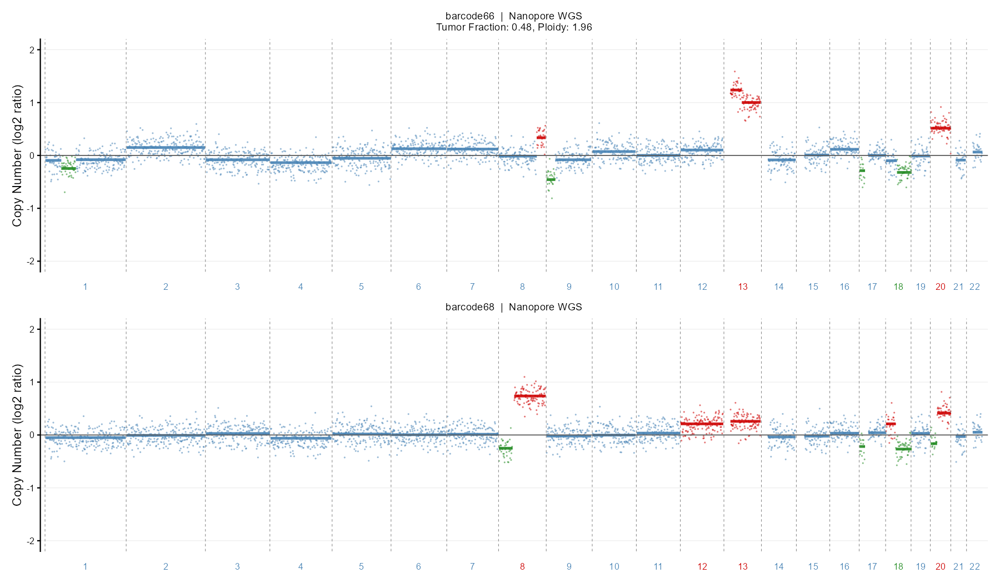

# CNAppR

[](LICENSE)
[](https://cran.r-project.org/)
[]()

CNAppR is an R package for the quantification and integrative analysis of somatic copy number alterations (CNAs) in cancer. It extends the original [CNApp](https://github.com/ait5/CNApp) framework (Franch-Expósito et al., *eLife* 2020) with a native BAM processing pipeline supporting both short-read (Illumina WES/WGS) and long-read (Nanopore) sequencing, GSEA-based pathway enrichment, and Kaplan–Meier survival analysis.

CNAppR accepts two types of input:
- **Pre-segmented data** from any upstream tool (ASCAT, CNVkit, ichorCNA, SNP arrays)
- **Aligned BAM files** processed directly through the built-in read-counting and segmentation pipeline

---

## Installation

```r
devtools::install_github("Albertotorrejon/CNAppR")
```

Optional dependencies for BAM processing — install only what you need:

```r
# Read counting and CBS segmentation
BiocManager::install(c("Rsamtools", "GenomicRanges", "DNAcopy"))

# GC content correction reference genomes (~800 MB each)
BiocManager::install("BSgenome.Hsapiens.UCSC.hg19")
BiocManager::install("BSgenome.Hsapiens.UCSC.hg38")
```

---

## BAM pipeline

`run_bam_pipeline()` takes a single aligned BAM file and returns a ready-to-use segment table. Internally it performs read counting per genomic bin, GC content correction, mappability filtering, and CBS segmentation via `DNAcopy`. The `sequencing_type` argument controls bin size defaults and outlier smoothing: use `"illumina"` for standard short-read data and `"nanopore"` for long-read low-pass WGS.

```r
# WES — Illumina short-read
seg_wes <- run_bam_pipeline(
  bam_path        = "tumor.bam",
  sample_id       = "sample_01",
  sequencing_type = "illumina",
  targets_bed     = "capture_kit.bed",   # restricts counting to exon targets
  genome_build    = "hg19"
)

# WGS — Nanopore low-pass cfDNA
seg_wgs <- run_bam_pipeline(
  bam_path        = "cfDNA_nanopore.bam",
  sample_id       = "sample_01",
  sequencing_type = "nanopore",
  bin_size        = 1000000L,            # 1 Mb bins recommended for low-pass
  genome_build    = "hg19"
)
```

Both functions return a data frame with columns `chr`, `loc.start`, `loc.end`, `seg.mean` compatible with all downstream CNAppR functions.

> **Coverage routing:** when the estimated mean coverage is below 10×, CNAppR automatically delegates to [ichorCNA](https://github.com/broadinstitute/ichorCNA) for segmentation and tumour fraction estimation. This is the recommended path for low-pass WGS and liquid biopsy cfDNA samples. Above 10×, the built-in CBS pipeline is used.

### Panel of Normals (PoN)

For WES cohorts, a Panel of Normals corrects for systematic technical biases (probe efficiency, GC waves) that are consistent across samples. Build a PoN once from matched normal BAMs and pass it to every tumour run:

```r
pon <- build_pon(
  bam_paths       = c("normal1.bam", "normal2.bam", "normal3.bam"),
  genome_build    = "hg19",
  experiment_type = "wes"
)

seg <- run_bam_pipeline("tumor.bam", sample_id = "sample_01",
                         sequencing_type = "illumina",
                         genome_build = "hg19", pon = pon)
```

### Combining WES and WGS samples

`harmonize_segments()` normalises and merges segment tables produced by different platforms or sequencing types into a single cohort-level table, enabling joint scoring across heterogeneous datasets:

```r
seg_all <- harmonize_segments(
  segments_list = c(seg_wes_list, seg_wgs_list),
  source        = c(rep("wes", length(seg_wes_list)),
                    rep("wgs", length(seg_wgs_list)))
)
```

---

## Segmentation and scoring

`resegment_sample()` post-processes the raw CBS segments for a single sample: it merges short noisy fragments, applies gain/loss thresholds, and classifies each alteration as **focal** (sub-arm), **arm-level**, or **chromosomal**. Running it across a cohort produces a clean, classified segment list ready for scoring and visualisation.

`calculate_cna_scores()` then summarises the CNA burden of each sample into three orthogonal scores:

```r
library(CNAppR)

# Load pre-segmented data (or use output from run_bam_pipeline)
data <- read_cna_file("path/to/segments.txt")

# Example with the bundled TCGA-LIHC dataset (354 samples)
data <- read_cna_file(
  system.file("models", "datos TFM",
              "LIHC_354_cnvsegments_input_scores_nopurity.txt",
              package = "CNAppR")
)

# Re-segment the full cohort
sample_ids <- unique(data$ID)
seg <- lapply(sample_ids, function(id) {
  tryCatch(resegment_sample(data, sample_id = id),
           error = function(e) { warning(id, ": ", conditionMessage(e)); NULL })
})
names(seg) <- sample_ids
seg <- Filter(Negate(is.null), seg)

# Compute CNA scores
scores <- calculate_cna_scores(seg)
head(scores)
#>              FCS BCS    GCS
#> TCGA-2Y-A9GS   2   3  0.82
#> TCGA-DD-A1QA   0   1 -0.54
```

| Score | Description |
|---|---|
| **FCS** | Focal CNA Score — length-weighted burden of sub-arm alterations |
| **BCS** | Broad CNA Score — count of arm-level and chromosomal alterations |
| **GCS** | Global CNA Score — normalised linear combination of FCS and BCS |

High GCS samples typically show chromosomal instability (CIN) patterns; high FCS with low BCS is characteristic of focal amplifications (e.g. oncogene amplicons).

---

## Visualisation

CNAppR provides three complementary plot functions:

- `plot_frequency_profile()` — cohort-level gain/loss frequency across the genome, using any reference granularity (arm-level, cytoband, or WES targets)
- `plot_genome_wide_cna()` — ASCAT-style single-sample profile with per-bin log2 ratio dots coloured by CNA call (NEUT, HETD, GAIN, AMP) and segment mean lines
- `plot_segmentation()` — side-by-side comparison of original and re-segmented profiles for QC

```r
# Cohort-level frequency profile
arm_ref <- system.file("aux_files/segmented_files_hg19/autosomes_hg19_by_arms.txt",
                       package = "CNAppR")
freq <- compute_region_frequencies(seg, arm_ref, gain_thr = 0.23, loss_thr = -0.23)
plot_frequency_profile(freq, title = "Copy Number Frequency | TCGA-LIHC")

# Single-sample genome-wide profile (requires bins from read_bam_qc or run_bam_pipeline)
plot_genome_wide_cna(bins_data, seg_data, sample_id = "sample_01",
                     tumor_fraction = 0.48, ploidy = 1.96)

# QC: before / after re-segmentation
plot_segmentation(original_data, resegmented_data, sample_id = "sample_01")
```



---

## Pathway enrichment

`run_gsea()` connects the CNA profile of a sample to biological pathway activity. It builds a gene-level rank vector from the annotated segment log2 ratios and runs pre-ranked GSEA against MSigDB collections (Hallmark, C2, or others) via `fgsea`. Amplified genes receive positive ranks; deleted genes receive negative ranks.

Requires `fgsea` and `msigdbr`:

```r
BiocManager::install("fgsea")
install.packages("msigdbr")

annotated <- annotate_cna_genes(seg[[sample_id]], genome_build = "hg19")
ranks     <- build_gene_ranks(annotated, score_col = "seg.mean")

gsea_res  <- run_gsea(ranks, collections = c("H", "C2"))
gsea_res$plot         # NES barplot, top pathways by |NES|
gsea_res$significant  # data frame of pathways with FDR < 0.05
```

---

## Survival analysis

`run_survival_analysis()` stratifies samples by CNA score (FCS, BCS, or GCS) into high/low groups and tests for differences in overall or progression-free survival using the log-rank test. It returns a Kaplan–Meier curve and the associated p-value.

Requires `survival` and `survminer`:

```r
install.packages(c("survival", "survminer"))

res <- run_survival_analysis(scores, survival_data = surv_df, score_var = "GCS")
res$plot    # Kaplan-Meier curve
res$pvalue  # log-rank p-value
```

`surv_df` must have columns `time` (numeric, months or days) and `event` (0 = censored, 1 = event), with row names matching the sample IDs in `scores`.

---

## Input format

Minimum required columns for pre-segmented data:

| Column | Type | Description |
|---|---|---|
| `ID` | character | Sample identifier |
| `chr` | integer | Chromosome (1–22) |
| `loc.start` | integer | Segment start position (bp) |
| `loc.end` | integer | Segment end position (bp) |
| `seg.mean` | numeric | Log2 copy number ratio |

Optional columns preserved throughout the pipeline: `BAF`, `purity`.

---

## Citation

If you use CNAppR, please cite the original CNApp paper:

> Franch-Exposito S, Bassaganyas L, Vila-Casadesus M, Hernandez-Illan E, Esteban-Fabro R, Diaz-Gay M, Lozano JJ, Castells A, Llovet JM, Castellvi-Bel S, Camps J.
> **CNApp, a tool for the quantification of copy number alterations and integrative analysis revealing clinical implications.**
> *eLife* 2020;9:e50267. https://doi.org/10.7554/eLife.50267

---

MIT © 2026 Alberto Torrejón Aquino · UOC
